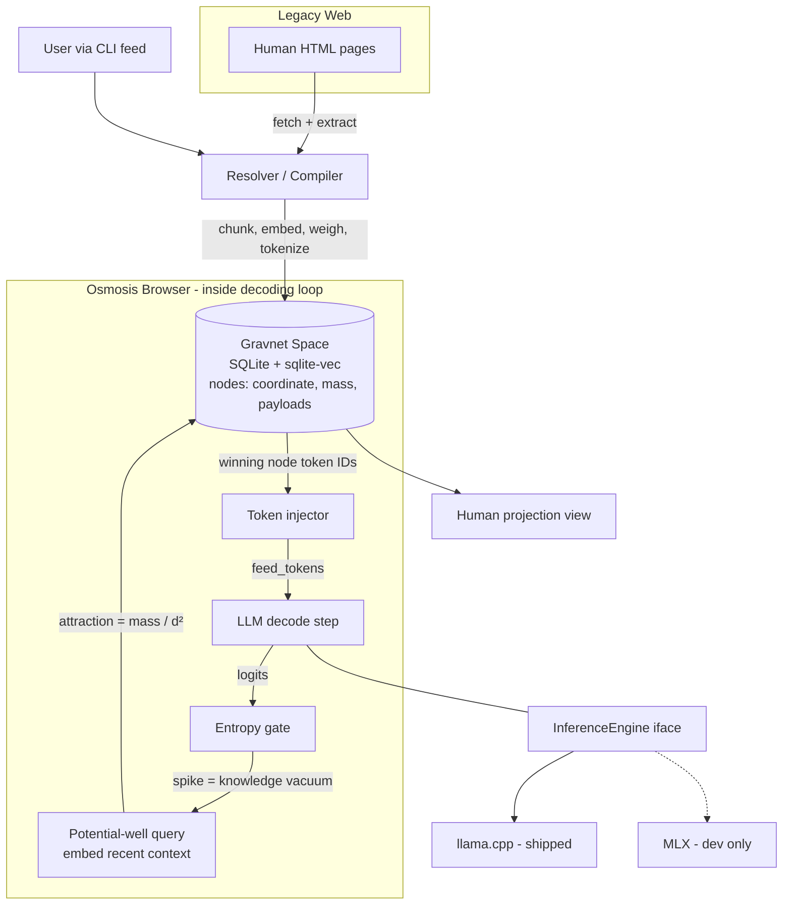

---

sessionId: session-260706-233901-kr4c
---

# Requirements

### Overview & Goals

**Gravnet** — a web built natively for LLMs, not humans. Instead of the model *asking* for information (HTTP requests, search queries, tool calls — all token-expensive human bionics), information **falls into the model's context by physics**: knowledge nodes exert mass-weighted gravitational pull, and the model's own softmax entropy opens the gate. The browser is an organ inside the decoding loop, not a tool the model calls.

Goals:
- **Zero-ask browsing**: the model spends *no tokens* on browsing syntax — knowledge is injected as raw token IDs mid-generation when uncertainty spikes.
- **A new protocol**: addresses are embedding-space coordinates (`gn://…`), not URLs; retrieval is a gravity computation, not a search-engine lookup — no Google dependency.
- **Digest the legacy web**: a Resolver compiles human HTML pages into native Gravnet nodes (pre-tokenized, embedded, mass-weighted).
- **For humans too**: a projection view lets you inspect the space and feed data in.
- **Shippable to everyone**: cross-platform core (Windows/Linux/macOS) via llama.cpp; MLX kept as a fast dev lane on the M4.

### Scope

**In scope (v1 — "full osmosis loop"):**
- `InferenceEngine` abstraction with a llama-cpp-python shipped backend + optional MLX dev backend.
- Gravnet space: node store with coordinates, mass, typed links, polyglot token payloads.
- Gravity retrieval: `attraction = mass / distance²` in embedding space.
- Resolver: URL → extract → chunk → embed → weigh → pre-tokenize → node.
- Osmosis browser: entropy-gated, in-loop token injection with budgets and cooldowns.
- CLI: `gravnet feed`, `gravnet chat`, `gravnet space` (human projection).

**Out of scope (v1, schema-reserved for v2):**
- Pre-computed KV-cache payload injection (node schema reserves the field; token-level injection is the v1 lane).
- Distributed/multi-machine Gravnet (v1 is a local universe).
- Model fine-tuning; autonomous crawling beyond user-fed URLs; GUI app packaging.

### User Stories
- As a **user**, I want to feed URLs/documents into Gravnet so that my local LLM's universe contains the knowledge I care about.
- As a **local LLM**, I want missing knowledge to fall into my context automatically when I'm uncertain, so I never hallucinate around a gap or burn tokens on tool-call JSON.
- As a **user**, I want to chat with a model that browses Gravnet invisibly, and *see* which nodes fell in and why (entropy trace, gravity scores).
- As a **human**, I want to inspect the knowledge space (nodes, masses, links) in a readable projection.

### Functional Requirements
1. `gravnet feed <url|file>` compiles a source into ≥1 nodes with coordinate, mass, and token payload for the active model's tokenizer.
2. `gravnet chat` runs a generation loop where softmax entropy is measured every step; when the adaptive threshold trips, the top-attracted node's tokens are spliced into context and generation resumes — with no tool-call text ever produced by the model.
3. Injection is governed: max injections per reply, cooldown window, dedup of already-injected nodes.
4. Every injection is logged with entropy value, query coordinate, chosen node, and gravity score (visible via `--trace`).
5. `gravnet space` lists/inspects nodes: `gn://` address, mass, preview, link structure.
6. The same knowledge store works unchanged whichever engine backend (llama.cpp / MLX) is active; token payloads are cached per-tokenizer.

### Non-Functional Requirements
- Runs on a 16 GB M4 with a 4–8B GGUF model + GGUF embedding model concurrently.
- Pure-Python + wheels only (llama-cpp-python, sqlite-vec) — no services, no Docker — so Windows ship is `pip install`.
- Entropy monitoring overhead ≤ ~10% of raw decode speed.
- MLX is an optional extra (`pip install gravnet[mlx]`), never a core dependency.

# Technical Design

### Current Implementation
Empty repository (`/Users/asishsharma/programming/Llm`) — green-field. Local environment verified earlier: Apple M4, 16 GB, Ollama models present but Ollama's API cannot expose tokens/logits, which is exactly why Gravnet embeds its own engine layer.

### Key Decisions
1. **Injection layer = token-level (v1), KV-ready schema** — nodes store token-ID payloads spliced directly into context; the node schema reserves a `kv_payload` field so per-architecture KV-cache injection can become a v2 lane without redesign.
2. **Trigger = entropy-gated osmosis** — the model never asks; a sliding-window entropy spike (adaptive threshold `μ + λσ`) opens the gate. Chosen over continuous field pull (cheaper per step) and navigation tokens (needs finetuning).
3. **Engine = llama-cpp-python shipped, MLX dev adapter** — only llama.cpp gives raw token feed + per-step logits on Windows/Linux/macOS; MLX adapter (~200 lines) kept for fast M4 experimentation. Both hide behind one `InferenceEngine` interface.
4. **Embeddings via GGUF too** (e.g. `nomic-embed-text-v1.5` through llama-cpp-python embedding mode) — keeps a single cross-platform runtime, avoids shipping PyTorch.
5. **Store = SQLite + sqlite-vec** — single-file, zero-service, cross-platform vector search; adequate for a local universe (≤10⁵ nodes).
6. **Gravity, not search**: relevance is `mass / (cos_distance² + ε)`; mass = information density × validation count — the space self-organizes, no ranking service.

### Proposed Changes
New Python package `gravnet` with five organs:

- **Engine** (`gravnet/engine/`) — `InferenceEngine` ABC: `tokenize/detokenize`, `feed_tokens(ids)`, `step() -> logits`, `entropy(logits)`; `LlamaCppEngine` (shipped), `MLXEngine` (optional extra).
- **Space** (`gravnet/space/`) — `Node` model, `Store` (SQLite + sqlite-vec), `gravity.py` (attraction scoring), `address.py` (`gn://` = base64 of quantized coordinate).
- **Resolver** (`gravnet/resolver/`) — `fetch.py` (httpx), `extract.py` (trafilatura), `compile.py`: chunk → embed → mass → pre-tokenize → store. Also accepts local files / raw text (feed anything in).
- **Osmosis browser** (`gravnet/browser/`) — `entropy.py` (sliding window, adaptive threshold), `osmosis.py`: the decoding loop that fuses engine + space — monitors entropy each step, on trigger embeds the recent decoded window as the potential-well query, gravity-searches, splices the winning node's token payload (wrapped in minimal delimiter tokens), resumes decoding; enforces budget/cooldown/dedup.
- **Projection + CLI** (`gravnet/projection/`, `gravnet/cli.py`) — `feed`, `chat [--trace]`, `space` commands (rich-based TUI projection for humans).

### Data Models / Contracts
```python
class Node:
    id: str                 # gn:// address (quantized coordinate hash)
    coordinate: list[float] # embedding vector (position in space)
    mass: float             # info_density * validation_count
    text: str               # canonical knowledge text
    payloads: dict[str, list[int]]  # tokenizer_id -> token IDs (cached lazily)
    kv_payload: bytes | None        # RESERVED v2: per-arch KV cache
    links: list[tuple[str, float]]  # (node_id, gravitational weight)
    source: str             # origin URL/file

class InferenceEngine(ABC):
    def tokenize(self, text: str) -> list[int]: ...
    def detokenize(self, ids: list[int]) -> str: ...
    def feed_tokens(self, ids: list[int]) -> None:   # native injection door
    def step(self) -> np.ndarray:                    # next-token logits
    def sample(self, logits) -> int: ...

# Osmosis gate (per decode step)
H_t = softmax_entropy(logits)
if mean(H[-k:]) > mu + lam * sigma and cooldown_ok and budget_left:
    q = embed(detokenize(last_W_tokens))
    node = argmax(mass_i / (cos_dist(q, c_i)**2 + eps))
    engine.feed_tokens(delim_open + node.payloads[tok_id] + delim_close)
```

### File Structure
```
pyproject.toml            # deps: llama-cpp-python, sqlite-vec, httpx,
gravnet/                  #       trafilatura, numpy, rich, typer
  engine/{base,llamacpp,mlx_backend}.py
  space/{node,store,gravity,address}.py
  resolver/{fetch,extract,compile}.py
  browser/{entropy,osmosis}.py
  embed/embedder.py       # GGUF embedding model wrapper
  projection/space_view.py
  cli.py
tests/
```

### Architecture Diagram


### Risks
- **Threshold tuning**: entropy spikes also occur at benign branch points (style choices) → adaptive `μ + λσ` baseline calibrated per-model in first ~50 steps + cooldown; `--trace` makes tuning observable.
- **Injection derailment**: spliced tokens can knock generation off course → minimal delimiters, capped payload size (~256 tokens), max 3 injections/reply.
- **Coordinate drift across embedding models**: coordinates are tied to the embedder → store embedder id in DB, refuse mixed-space queries.
- **16 GB budget**: 4B chat model (q4) + embedding GGUF + cache fits; document recommended models.

# Testing

### Validation Approach
Unit-test the physics and plumbing in isolation (no LLM needed — gravity math, entropy gate, store, resolver are pure functions), then run integration tests with a small real GGUF model (e.g. Qwen2.5-0.5B / Llama-3.2-1B) so the full osmosis loop is exercised end-to-end on-device.

### Key Scenarios
1. **Feed → node**: `gravnet feed <url>` on a fixture HTML page produces nodes with non-zero mass, valid `gn://` address, and a token payload that round-trips through `detokenize`.
2. **Gravity ordering**: given nodes with known coordinates/masses, `attraction = mass/d²` ranks the intuitively-relevant heavy node first; a light-but-close node can beat a heavy-but-far one only per the formula.
3. **Osmosis fires on a gap**: seed the space with a fact the small model cannot know (fictional entity); ask about it in `gravnet chat`; assert the trace shows an entropy spike → injection of the seeded node → the answer contains the fact.
4. **Osmosis stays silent when full**: ask trivia the model knows; assert zero injections (no false-positive pulls) on a calibrated threshold.
5. **Human projection**: `gravnet space` lists the seeded nodes with mass and address.

### Edge Cases
- Empty space: chat must degrade to plain generation, never crash the gate.
- Injection budget exhausted: further spikes logged but not injected.
- Duplicate pull: same node never injected twice in one reply.
- Oversized node payload: truncated to cap, delimiters intact.
- Mixed embedder: store created with embedder A, opened with embedder B → explicit refusal, not silent garbage.
- Unfetchable/paywalled URL: resolver reports failure, store untouched.

### Test Changes
- `tests/test_gravity.py`, `tests/test_entropy_gate.py`, `tests/test_store.py`, `tests/test_resolver.py` — pure unit tests, fixture HTML included in repo.
- `tests/test_osmosis_integration.py` — marked `@pytest.mark.model` (needs a downloaded small GGUF), skipped in bare CI.
- MLX adapter tests marked `@pytest.mark.mlx`, auto-skipped off-Apple hardware.

# Delivery Steps

###   Step 1: Scaffold project and build the InferenceEngine layer
A working `gravnet` package that can load a GGUF model, feed raw token IDs, and expose per-step logits + entropy — the native doorway proven.

- Create `pyproject.toml` (deps: `llama-cpp-python`, `numpy`, `typer`, `rich`; extras: `mlx`) and package skeleton per the File Structure.
- Implement `engine/base.py`: `InferenceEngine` ABC with `tokenize`, `detokenize`, `feed_tokens`, `step`, `sample`.
- Implement `engine/llamacpp.py`: llama-cpp-python backend with direct `eval`/logits access and softmax-entropy helper.
- Add a plain `gravnet chat` loop (no osmosis yet) as a smoke test that generation works token-by-token through the interface.
- Unit tests for tokenize/detokenize round-trip and entropy computation on synthetic logits.

###   Step 2: Build the Gravnet space: nodes, mass, gravity, addresses
A persistent local knowledge universe where nodes have coordinates and mass, and gravity retrieval ranks them — queryable standalone.

- Implement `space/node.py`: `Node` dataclass (coordinate, mass, text, per-tokenizer `payloads`, reserved `kv_payload`, links, source).
- Implement `space/store.py`: SQLite + `sqlite-vec` persistence with embedder-id guard against mixed coordinate spaces.
- Implement `space/gravity.py`: `attraction = mass / (cos_dist² + ε)` scoring and top-k retrieval.
- Implement `space/address.py`: `gn://` addresses derived from quantized coordinates.
- Implement `embed/embedder.py`: GGUF embedding model (nomic-embed) via llama-cpp-python embedding mode.
- Unit tests: gravity ranking with known masses/distances, store round-trip, address determinism.

###   Step 3: Build the Resolver: compile the legacy web into nodes
`gravnet feed <url|file|text>` digests human web pages into native Gravnet nodes.

- Implement `resolver/fetch.py` (httpx with sane timeouts/UA) and `resolver/extract.py` (trafilatura content extraction).
- Implement `resolver/compile.py`: chunk extracted knowledge → embed coordinates → compute mass (information density × validation count) → lazily pre-tokenize payloads for the active tokenizer → write nodes + intra-document gravitational links.
- Wire the `gravnet feed` CLI command with progress output; support URLs, local files, and raw text.
- Tests with fixture HTML: node count, non-zero mass, payload/detokenize round-trip; unfetchable-URL failure path.

###   Step 4: Build the osmosis browser: entropy-gated in-loop injection
The invention works end-to-end: during `gravnet chat`, an entropy spike pulls the strongest-attracting node's tokens straight into the model's context — zero asking.

- Implement `browser/entropy.py`: sliding-window entropy with adaptive threshold (`μ + λσ` calibrated over first steps) and cooldown logic.
- Implement `browser/osmosis.py`: the fused decode loop — step, gate check, potential-well query (embed recent decoded window), gravity search, splice winning payload via `feed_tokens` with minimal delimiters, resume; enforce max-injections budget, payload cap, and per-reply dedup.
- Add `--trace` mode logging every gate decision: entropy value, query, chosen node, gravity score.
- Integration test (`@pytest.mark.model`, small GGUF): seeded fictional fact triggers injection and appears in the answer; known-trivia prompt produces zero injections; empty-space and budget-exhausted edge cases.

###   Step 5: Human projection, MLX dev backend, and end-to-end polish
Humans can see the same universe the LLM browses, the M4 dev lane is live, and a fresh clone demos the whole loop.

- Implement `projection/space_view.py` + `gravnet space` command: rich TUI listing nodes with `gn://` address, mass, preview, and links; per-node detail view.
- Implement `engine/mlx_backend.py`: MLX adapter behind the same `InferenceEngine` interface (optional `gravnet[mlx]` extra), with `@pytest.mark.mlx` tests auto-skipped off-Apple hardware.
- Add a demo script + README: recommended models for 16 GB, feed two pages, run a traced chat showing osmosis firing.
- Final pass: consistent error messages, config file for thresholds/budgets, full test-suite run.